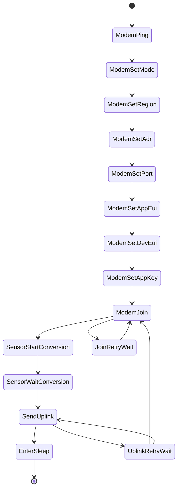

# ESP32 LoRaWAN Industrial Node (LoRa-E5 + ADS1115)

Boilerplate de firmware para un nodo industrial de ultra bajo consumo basado en ESP32.

El nodo despierta cada 15 minutos, adquiere una señal de proceso 4-20 mA mediante ADS1115, convierte a magnitud física (0-100 psi), envía un uplink binario por LoRaWAN y vuelve inmediatamente a Deep Sleep después del evento de transmisión completada.

## Alcance técnico

- Framework: Arduino sobre PlatformIO
- MCU: ESP32 (`esp32dev`)
- ADC externo: ADS1115 por I2C (16 bits)
- Módem LoRaWAN: Seeed LoRa-E5 por UART (AT commands)
- Arquitectura: máquina de estados no bloqueante, sin `delay()`
- Payload: binario compacto (sin JSON ni `String`)

## Nota sobre LoRa-E5 y LMIC

Este proyecto usa el stack LoRaWAN interno del LoRa-E5 vía AT porque ese módulo integra MCU + radio + stack.

`MCCI LMIC` se usa cuando el ESP32 controla directamente un transceiver LoRa (por ejemplo SX127x/SX126x por SPI). Con LoRa-E5, el enfoque correcto es UART AT.

## Estructura

- `platformio.ini`: configuración de entorno y credenciales OTAA por build flags
- `src/main.cpp`: firmware principal
- `docs/hardware.md`: cableado y consideraciones eléctricas industriales
- `docs/commissioning.md`: puesta en marcha LoRaWAN OTAA
- `docs/power-optimization.md`: lineamientos de energía y autonomía

## Formato de payload

Uplink de 4 bytes en Big Endian:

| Byte(s) | Campo | Unidad | Escala |
|---|---|---|---|
| 0..1 | Pressure | psi | `value / 100` |
| 2..3 | LoopCurrent | mA | `value / 100` |

Ejemplo:

- `0x1388` en bytes `0..1` = `50.00 psi`
- `0x07D0` en bytes `2..3` = `20.00 mA`

## Flujo de estados



## Configuración rápida

1. Editar OTAA y región en `platformio.ini` (`build_flags`):
   - `LORAE5_REGION`
   - `LORAE5_APP_EUI`
   - `LORAE5_DEV_EUI`
   - `LORAE5_APP_KEY`
   - `LORAE5_UPLINK_PORT`
2. Ajustar `kShuntOhms` en `src/main.cpp` si tu front-end analógico usa otro resistor.
3. Compilar y subir:

```bash
pio run
pio run -t upload
pio device monitor
```

## Comandos AT relevantes (LoRa-E5)

- `AT`
- `AT+MODE=LWOTAA`
- `AT+DR=<REGION>` (ejemplo: `US915`, `AU915`, `EU868`)
- `AT+ID=AppEui,"..."`
- `AT+ID=DevEui,"..."`
- `AT+KEY=APPKEY,"..."`
- `AT+JOIN`
- `AT+MSGHEX="..."`

Referencia oficial: [Seeed LoRa-E5 AT Command Specification (PDF)](https://files.seeedstudio.com/products/317990687/res/LoRa-E5%20AT%20Command%20Specification_V1.0%20.pdf)

## Operación de energía

- Deep Sleep activado por temporizador: `15 min`
- Al finalizar uplink (`+MSGHEX: Done`) se entra a Deep Sleep sin espera adicional
- Se envía `AT+LOWPOWER` al LoRa-E5 justo antes de dormir (best effort)

## Pendientes típicos en un proyecto productivo

- Validación EMC/ESD del front-end 4-20 mA
- Calibración multi-punto de presión
- Manejo de caída/sensado de batería
- MAC tuning por región (canales/sub-band, ADR policy)
