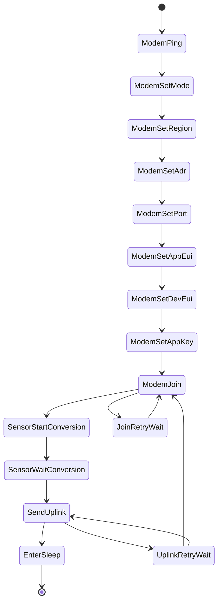

<p align="center">
  
</p>

<h1 align="center">ESP32 LoRaWAN Industrial Node</h1>

<p align="center">
  Industrial low-power telemetry boilerplate for <b>ESP32 + LoRa-E5 + ADS1115</b>.
  <br/>
  4-20 mA acquisition, compact binary payload, LoRaWAN uplink, immediate deep sleep.
</p>

<p align="center">
  <a href="./LICENSE"></a>
  
  
  
  
  
</p>

---

## Overview

This repository provides a production-oriented firmware foundation for industrial IoT nodes where energy budget and deterministic behavior matter.

Each wake cycle does exactly one job:

1. Wake from deep sleep (15-minute interval)
2. Read a 4-20 mA loop through ADS1115
3. Convert to engineering units (`0-100 psi`)
4. Pack data into a 4-byte binary payload
5. Send LoRaWAN uplink through Seeed LoRa-E5 (AT modem)
6. Enter deep sleep immediately after TX completion

No JSON, no `String`, no `delay()` loops.

## Why AT Modem (LoRa-E5) Instead of LMIC

The Seeed LoRa-E5 module already contains an STM32WLE5 and integrated LoRaWAN stack.

For this hardware profile, the correct architecture is:

- ESP32 handles sensing and system orchestration
- LoRa-E5 handles LoRaWAN via UART AT commands

`MCCI LMIC` is generally used when the ESP32 directly drives a raw LoRa transceiver (e.g., SX127x/SX126x over SPI).

## Key Features

- Non-blocking event-driven finite state machine
- Deep sleep first design (battery-focused)
- ADS1115 high-resolution acquisition over I2C
- Compact big-endian payload encoding
- Retry strategy for join/uplink with bounded attempts
- Doxygen-style inline code documentation

## Hardware Configuration

### ESP32 <-> ADS1115 (I2C)

- `GPIO21` -> SDA
- `GPIO22` -> SCL
- ADS1115 address: `0x48`
- Input channel: `A0`

### ESP32 <-> LoRa-E5 (UART2)

- `GPIO16` <- LoRa-E5 TX
- `GPIO17` -> LoRa-E5 RX
- UART baudrate: `9600`

### 4-20 mA Front-end

Default shunt resistor in code:

- `Rshunt = 165R` (`0.1%` recommended)
- 4 mA -> ~0.66 V
- 20 mA -> ~3.30 V

Engineering conversion:

- `I(mA) = Vshunt / Rshunt * 1000`
- `psi = clamp((I - 4) / 16, 0..1) * 100`

## Payload Specification

Uplink payload size: `4 bytes` (big-endian)

| Bytes | Field | Unit | Scale |
|---|---|---|---|
| 0..1 | Pressure | psi | value / 100 |
| 2..3 | Loop current | mA | value / 100 |

Example decoding:

- `0x1388` -> `50.00 psi`
- `0x07D0` -> `20.00 mA`

## State Machine



## Repository Layout

- `src/main.cpp`: firmware state machine and integration logic
- `platformio.ini`: board setup, dependencies, build-time credentials
- `docs/hardware.md`: wiring and electrical integration notes
- `docs/commissioning.md`: LoRaWAN OTAA provisioning checklist
- `docs/power-optimization.md`: power and autonomy guidance
- `docs/payload-decoder.js`: payload decoder for TTN / ChirpStack
- `docs/assets/industrial-node-logo.svg`: README visual asset

## Quick Start

### 1. Configure OTAA credentials

Edit `platformio.ini` build flags:

- `LORAE5_REGION`
- `LORAE5_APP_EUI`
- `LORAE5_DEV_EUI`
- `LORAE5_APP_KEY`
- `LORAE5_UPLINK_PORT`

### 2. Build and flash

```bash
pio run
pio run -t upload
pio device monitor
```

### 3. Validate runtime sequence on serial monitor

Expected command flow:

- `AT`
- `AT+MODE=LWOTAA`
- `AT+DR=<REGION>`
- `AT+ID=AppEui,...`
- `AT+ID=DevEui,...`
- `AT+KEY=APPKEY,...`
- `AT+JOIN`
- `AT+MSGHEX="..."`

Successful uplink ends with `+MSGHEX: Done`, then the node enters deep sleep.

## Network Decoder

Use [payload-decoder.js](./docs/payload-decoder.js) in The Things Stack or adapt it for ChirpStack to decode the 4-byte uplink into:

- `pressure_psi`
- `loop_current_ma`

## Power Optimization Notes

- Wakeup interval defaults to 15 minutes (`esp_sleep` timer)
- TX completion leads directly to deep sleep transition
- `AT+LOWPOWER` is sent to the LoRa-E5 before sleeping (best effort)
- Bounded retry policy prevents uncontrolled active-time growth

## Recommended Next Improvements

- Persist a lightweight session state strategy to reduce OTAA joins in battery deployments
- Add supply-voltage measurement so the uplink can include node health, not just process value
- Add a production `secrets` override flow for CI/local builds instead of editing credentials inline
- Add calibration constants for the analog front-end to compensate resistor and sensor tolerance

## Useful References

- [Seeed LoRa-E5 product page](https://www.seeedstudio.com/LoRa-E5-Wireless-Module-p-4745.html)
- [Seeed LoRa-E5 AT Command Specification (PDF)](https://files.seeedstudio.com/products/317990687/res/LoRa-E5%20AT%20Command%20Specification_V1.0%20.pdf)

## License

This project is released under the [MIT License](./LICENSE).
